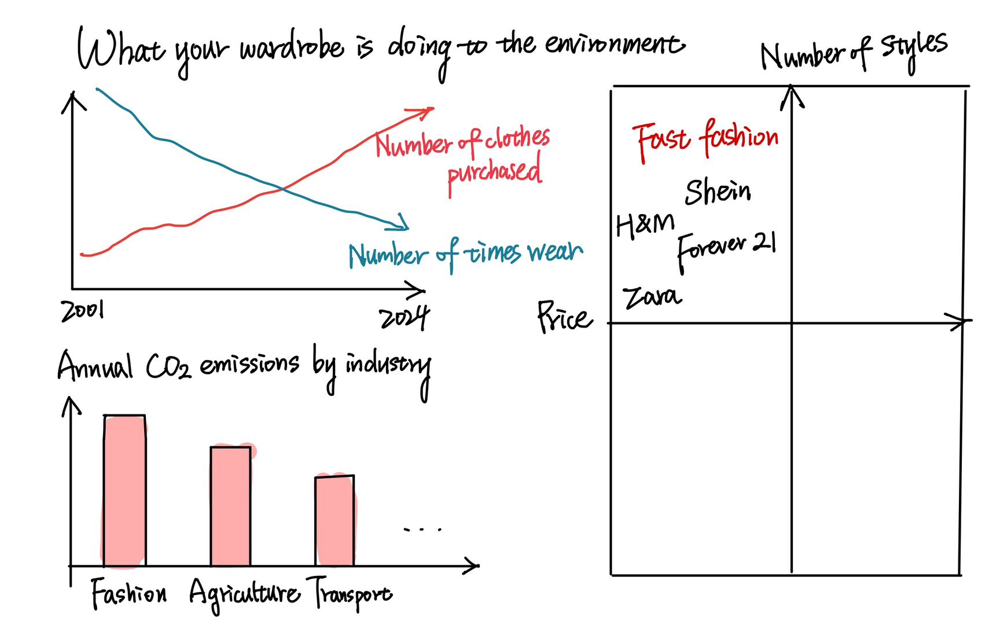
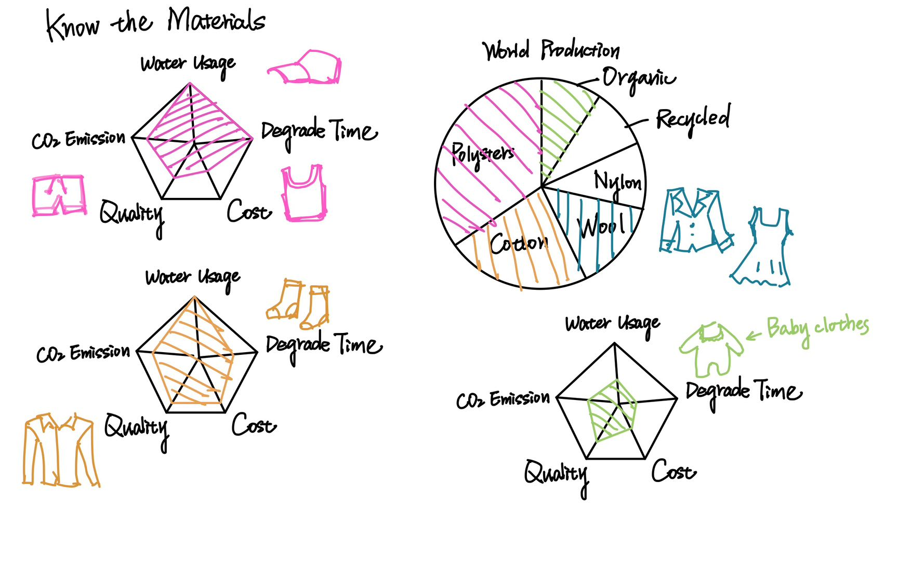
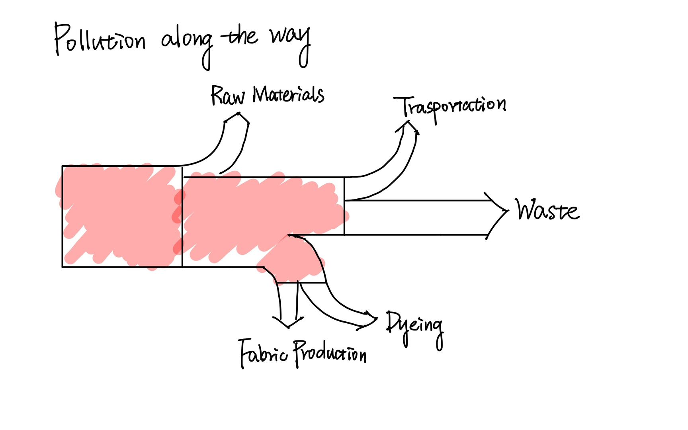

# Summary
The fashion industry is a significant contributor to global pollution, with a vast environmental cost associated with clothing production, consumption, and disposal. This project aims to shed light on the ecological impact of different types of clothes, tracing the journey from raw material production to the final product consumers buy, and the waste created when clothes are discarded.

I will explore the types of materials used in clothing—such as cotton, polyester, and newer innovations like organic fabrics—and analyze how their production contributes to environmental issues such as water pollution, carbon emissions, and toxic chemical release. The project will also delve into the supply chain, examining the often-overlooked processes of garment manufacturing, dyeing, and transportation, which further exacerbate environmental damage.

A critical aspect of fashion pollution is the waste generated by discarded clothes. This project will also investigate where these clothes go—landfills, incineration, or second-hand markets—and highlight how much of this waste ends up in developing countries, creating environmental and social challenges.

Finally, I want to advocate for alternatives to traditional fashion consumption by promoting the idea of "organic fashion." This includes choosing sustainable materials, supporting ethical fashion brands, and encouraging recycling and reuse practices. By understanding the full environmental cost of our clothing choices, consumers can be empowered to make more sustainable fashion decisions and contribute to a cleaner planet.

# Project Structure
1. Introduction: Fashion's Environmental Toll

    - What is your Lululemon made of? Do you know about the environmental cost behind each purchase?

    - Provide startling statistics on the fashion industry’s contribution to pollution.

2. Environmental Cost of Clothing Types

    - Educate the audience about different types of materials and clothes, and demonstrate the related environmental costs.

    - Cotton & Polyester & Synthetics & Alternative Materials

    - Visualization: Compare durability, water usage, carbon footprint, and degrading time of different fabric types.

3. The Supply Chain: Pollution Along the Way

    - Manufacturing & Dyeing: The chemical-heavy processes that result in water pollution and toxic runoff.

    - Transportation: Carbon emissions caused by global supply chains, with an emphasis on fast fashion.
      
    - The business logic behind the fashion industry

    - Visualization: A map showcasing global supply chains and associated emissions.

4. The Afterlife of Clothes: Waste and Disposal

    - Landfills and Incineration: Discuss the fate of clothes that don’t get recycled and their environmental impact.

    - Second-hand Markets: Examine how used clothes are shipped to developing countries, causing problems like excess waste and local market disruption.

    - Visualization: Flow of used clothes from the West to developing regions.

5. Advocating for Sustainable Fashion

    - Organic Fashion: Introduce the concept of sustainable and ethical fashion practices—using eco-friendly materials, fair labor practices, and mindful consumption.

    - Consumer Behavior: Encourage slow fashion, clothing repair, thrifting, and recycling initiatives.

    - Visualization: A positive comparison of traditional vs. organic fashion’s environmental impact.

6. Conclusion

    - Summarize the major environmental costs and solutions.

    - Empower consumers with actionable steps toward adopting organic fashion and sustainable practices.

# Initial Sketches

# Data Source
- Textile Exchange
  - https://textileexchange.org/knowledge-center/reports/materials-market-report-2023/
  - Textile Exchange's report includes materials produced for the fashion, textile, and apparel industries as well as for other industries.
- Ellen McArthur Foundation
  - https://www.ellenmacarthurfoundation.org/a-new-textiles-economy
  - The foundation has detailed reports and datasets on circular fashion, waste, and carbon emissions. The related data can be extracted from their reports.
- CDP
  - https://www.cdp.net/en/data/corporate-data#02d4482d332e1aef3437cd61c9bcc624
  - CDP holds the most comprehensive collection of corporate environmental data globally, including the sustainability disclosures of fashion brands.

# Method and medium
I plan to use Shorthand as the primary platform to create a narrative combining multimedia elements with data visualizations. For data visualizations, I will use Tableau to create interactive charts. These charts will be embedded within the Shorthand story.
