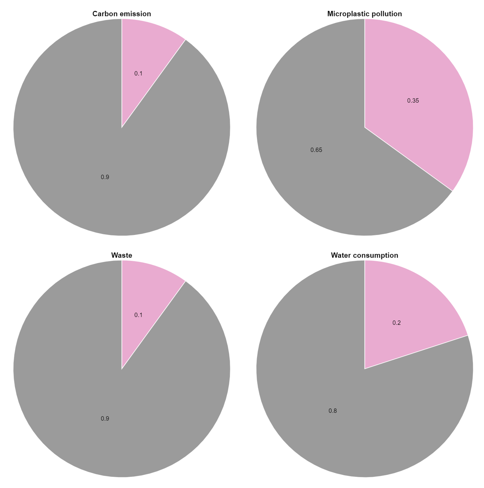
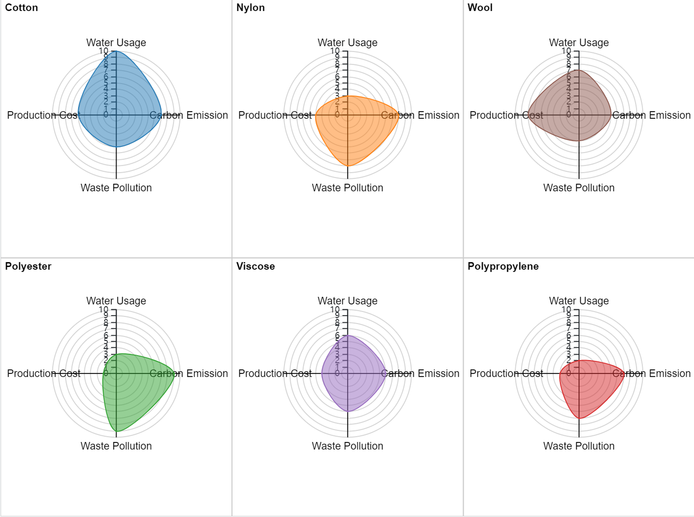

| [home page](https://ashwang623.github.io/portfolio/)) | [visualizing debt](dataviz2.md) | [critique by design](MakeoverMonday.md) | [final project I](final-project-1.md) | [final project II](final-project-2.md) | [final project III](final-project-part-three) |

# Wireframes/storyboards
The Environmental Price of Fashion: Unveiling the Hidden Footprint from Fabric to Landfill

Introduction: Have you ever thought about the environmental cost behind your fashionable leggings or printed t-shirt? They come at a high price—one that's not reflected on the tag.

General: Fashion is one of the most pollutive industry on earth. Meanwhile, we are buying more and more clothes and wear them less and less. It’s time to rethink the current clothing system and our role as consumers.

Viz 1: Contribution of the fashion industry to global pollution

Viz 2: Clothing sales vs. Clothing utilization over the years

Main Point 1: Environmental Cost of Fabrics: Different fabrics have vastly different environmental impacts. Cotton, for example, uses enormous amounts of water, while polyester is derived from oil and takes decades to degrade. As you can see, the industry still highly relies on fossil-based synthetics.

Viz 3: Radar chart for different fabrics

Viz 4: Global market share of different fabrics, 2022

Main Point 2: Supply Chain Pollutions: The impact is not just about the materials. The global supply chain adds another layer of pollution. For instance, dyeing fabrics is responsible for water contamination, while transporting garments across the globe creates massive carbon emissions."

Viz 5: Pollution along the supply chain (I have not worked out a visualization for this section yet. This pic will later be replaced.)

Main Point 3: The Afterlife of Clothes: The story doesn’t end when you stop wearing your clothes. Each year, 73% of clothing ends up landfilled or incinerated, releasing harmful toxins into the environment. Even donated clothes are often shipped to developing countries, overwhelming local markets and contributing to excess waste.

Viz 6: Material flows for clothing

Call to Action: Remember that the power to make a change lies in our choices. By choosing organic fabrics, buying second-hand, and supporting sustainable brands, we can reduce our impact. 

# User research 

## Target audience

The main audience is general customers interested in sustainability. These people are not necessarily familiar with environmental issues but care about the impact of their daily behaviors. The story aims to educate people about the facts behind the fashion industry and encourages shifts in consumption choices.

More specifically, I think the younger generations like the Millennials and Gen Z will be more interested in the topic. Youngsters are more likely to be swayed by fashion trends, yet also more open-minded and innovative in lifestyles.

Since I am a Millennial myself, my approach to identifying representative individuals to interview is screening from my own social circle. These are my screening criteria:

 - Whether they often buy new clothes for fashion
  
 - Whether they consider the environmental impact when making purchasing decisions

## Interview script

| Goal | Questions to Ask |
|------|------------------|
|  Evaluate the effectiveness of data visualizations    |  Were there any parts of the visualization that felt confusing or difficult to interpret?  What additional information may help to resolve confusion?            |
|  Evaluate whether the story is engaging    | Were there any specific sections of the story that resonated with you? What parts of the story felt less engaging?                |
|  Evaluate whether the story incentivizes people to make changes   | After seeing the story, do you feel motivated to make changes in your clothing choices? What barriers might prevent you from taking the actions suggested in the story?                |

## Interview findings

| Questions               | Working fashion enthusiast, 23 | College student, 23 | Young environmentalist, 26 |
|-------------------------|--------------------------------|-------------|-------------|
| Evaluate the effectiveness of data visualizations | The radar chart was interesting, but it felt a little overwhelming.|It would be better if the color of fabrics in the radar chart matched the market share.| Some of the charts were hard to follow just because of how quickly you skimmed through. Maybe you could make it easier by highlighting the key takeaway in bold.|
| Evaluate whether the story is engaging | The introduction was good, but some of the stats felt heavy and a bit technical. |I like the storytelling around the different materials. I didn’t know how much synthetic fabrics contributed to pollution, and that was a powerful moment.| It’s eye-opening to see how even donating clothes can have a negative impact. But I'm not sure how the supply chain part is connected to the overall problem |
| Evaluate whether the story incentivizes people to make changes   |I still care about styles and trends. I might look into eco-friendly options if they were fashionable.| It makes people think but not necessarily take action. Buying second-hand and researching sustainable brands seems like a hassle.| Thrifting is good advice, but it takes more time. I also wish sustainable fashion were affordable like fast fashion. Cost is a major barrier for many people. |

# Identified changes for Part III

| Research synthesis                       | Anticipated changes for Part III                                                |
|------------------------------------------|---------------------------------------------------------------------------------|
| The radar chart was most discussed and well-received but a little overwhelming. | Highlight key insights within the visualization itself and its connection with the market share chart. |
| The supply chain section felt unnecessary with less immediate engagement compared to other sections. |  Condense the supply chain story, maybe combine it with another section. |
| Participants resonate most positively with the "afterlife of clothes" section, especially regarding the impact of clothing waste. |  Expand the "afterlife of clothes" section with more compelling visuals.|
| Some participants expressed that sustainable fashion options seem costly or inconvenient, and they are not sure if they will make changes in clothes consumption. | Introduce sustainable fashion more clearly and provide more concrete actionable suggestions.|

